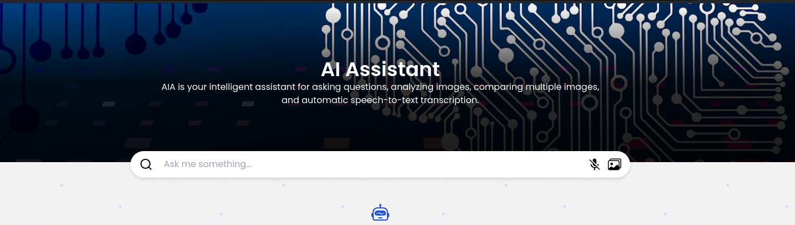
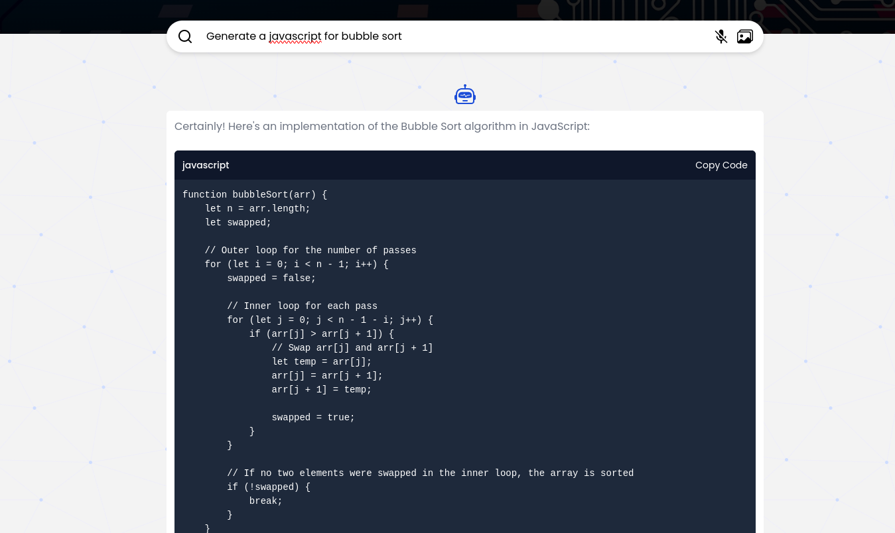

# Speech Recognition App

## Overview

A React application that utilizes the Web Speech API for speech recognition and transcription. It supports continuous listening and provides a simple interface for starting, stopping, and resetting the speech recognition process.

## Features

- **Question and Answer**: Ask questions and get responses using the OpenAI API.
- **Image Analysis**: Upload and analyze images.
- **Image Comparison**: Compare multiple images side by side.
- **Data Collection from Images**: Extract data from images for further analysis.
- **Real-time Transcription**: Converts spoken words into text in real-time.
- **Continuous Listening**: Keeps listening and transcribing until manually stopped.
- **Microphone Availability Check**: Ensures the microphone is available before starting.
- **Browser Compatibility**: Checks if the browser supports speech recognition.

## Features

- **Frontend**: ReactJS, Typescript
- **Backend**: ExpressJS, Typescript
- **APIs**: OpenAI API, Javascript Speech Recognition

## Usage

### 1. Ask Questions:

- Type your question and AIA will provide a response using the OpenAI API.

### 2. Analyze Images:

- Upload an image. AIA will analyze the image and display the results.

### 3. Compare Images:

- Upload multiple images. AIA will display the images side by side for comparison.

### 4. Collect Data from Images:

- Upload an image AIA will extract data from the image and present it for further analysis.

### 5. Speech-to-Text:

- Click the microphone icon and start speaking. AIA will automatically transcribe your speech to text and automatically send the text to OpenAI API once you stop talking in 1 second.

## Backend (API)

- To access the API, please fork the repository: https://github.com/mondejarmarron18/aia-api.git
